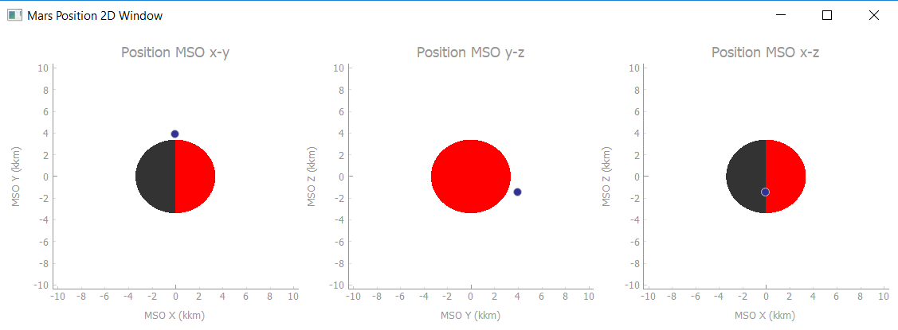
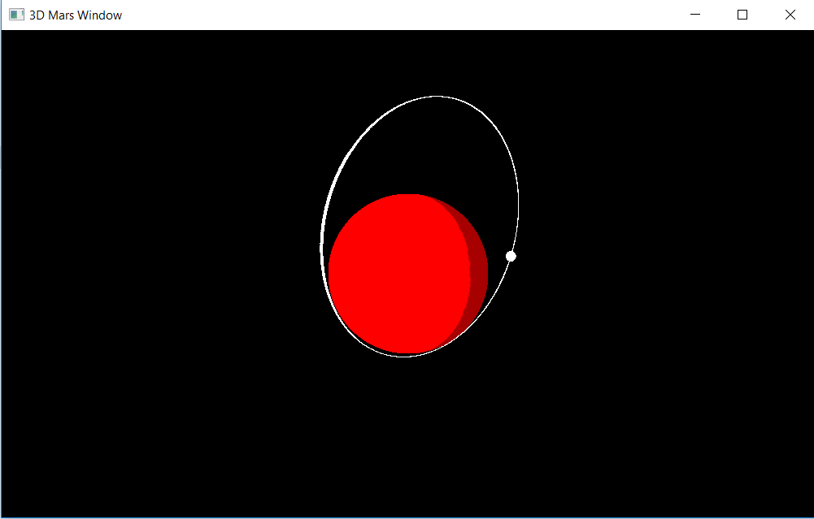
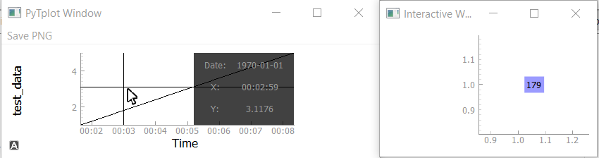
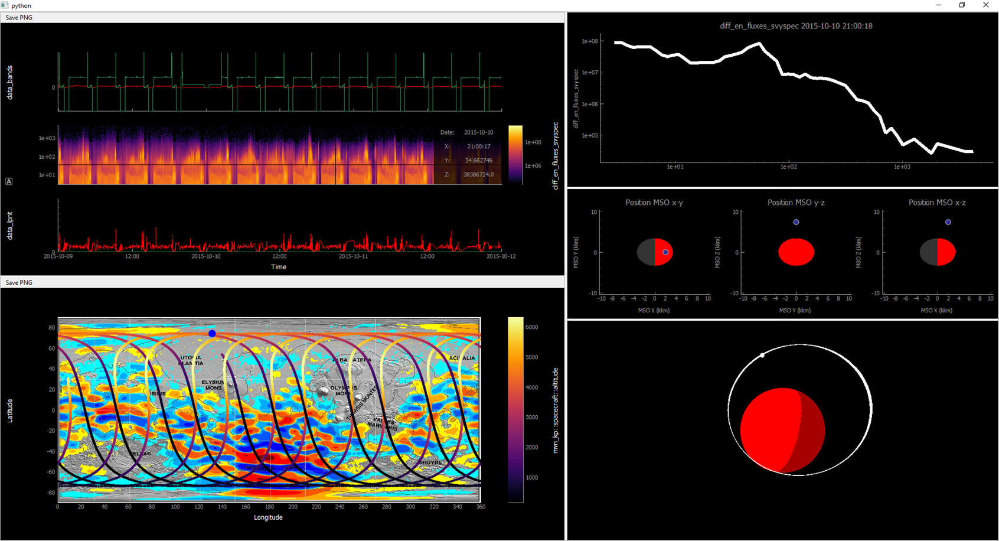

Interactive Plots
==================

Part of the appeal of IDL tplot is that its easy to make plots that interact with the primary plotting window, primarily based on the time that the user is hovering the mouse over.  

There are several interactive plots that are in pytplot, specifically ones that are useful for the MAVEN spacecraft, but this page will also describe how to create your own interactive plots.  

Spectrogram Slicing
-------------------

Slicing a spectrogram can be called in a few different ways.  The easiest way to do it would be to simply specify "slice=True" when calling tplot ::
    
	pytplot.tplot("spectrogram_data", slice=True)

Below is what the spectrogram slicer command looks like in a Bokeh graph.  

.. raw:: html
   :file: _images/specslicer.html

There are a few options one can set with the options command to modify this plot (see the options section):

=================== ==========   =====
Options             Value type   Notes
=================== ==========   =====
xlog_slice          bool         Sets x axis on interactive plot to log scale if True.
ylog_slice          bool         Sets y axis on interactive plot to log scale if True.
xrange_slice        flt list     Two numberes that give the x axis range of interactive plots.
yrange_slice        flt list     Two numberes that give the y axis range of interactive plots.
static              str          Creates a non-interactive spec-slicing plot.  Datetime string that 
                                 gives desired time to plot y and z values from a specplot.
static_tavg         str          Creates a non-interactive spec-slicing plot.  Datetime string that 
                                 gives desired time-averaged y and z values to plot from a spec plot.
t_average           int          Seconds around which the cursor is averaged when hovering over spectrogram
                                 plots.
=================== ==========   =====

Mars 2D Position
----------------

By linking a data tplot variable to tplot variables that contain spacecraft position information, one can bring up an interactive visualization of the spacecraft's position in MSO coordinates that changes depending on the time the 
user is hovering over.  

For example, suppose you have data in a tplot variable called "maven_data" and position information in the variables "mvn::kp::mso_x/y/z" ::
	
	pytplot.link("maven_data", "mvn::kp::mso_x", "x")
	pytplot.link("maven_data", "mvn::kp::mso_y", "y")
	pytplot.link("maven_data", "mvn::kp::mso_z", "z")
	pytplot.tplot("maven_data", pos_3d=True)

A window like the one below would appear, with a dot that moves around depending on where your mouse is hovered over on the main window.  

Mars 3D Position
-----------------

Similar to the above interactive plot, there is also a 3D viewer that is available if the user has pyopengl installed, which can be installed with the command ::

	pip install pyopengl
	
In this case, you can create a 3D spacecraft position viewer of mars after linking x/y/z position information to the data, and plotting it with the command :: 

	pytplot.tplot("maven_data", pos_3d=True)

Adding your Own Supplementary Qt Plots
----------------------------------------

.. note::
    This only works when plotting with pyqtgraph.  Bokeh only creates static HTML files, so it cannot communicate back to python once created.  

If you using pytplot in an IPython environment (including Jupyter notebooks), you can have multiple Qt windows open without issue.  This is because IPython continually runs a qt "event loop" in the background, similar to IDL.

However, if you are using python in a non-interactive environment (say just running a script), pyqtgraph needs to start an event loop to run, which is done as the last thing in a call to tplot().  Python will "freeze" and continue looking for events in the tplot window until the tplot window closes. 

This means that if you want multiple plots to appear at the same time, you need to supply a function to the tplot() command to call before it starts its event loop.  Lets say you have a custom plot you'd like to appear at the same time as the pytplot plot, you would make sure your function gets called with the following addition to the tplot command::
    
    pytplot.tplot(['variables_to_plot'], extra_functions=[your_func])

Or, if you need to supply arguements to your function::

    pytplot.tplot(['variables_to_plot'], extra_functions=[your_func], extra_function_args=[(arg1, arg2, arg3)])

Why would you want to ensure plots appear at the same time?  Mainly for interactivity purposes, as described in the following section. 

*Alternatively*, you can tell the tplot command to not begin the event loop at all, and you can call it yourself later.  This can be done simply by specifying::
	
	pytplot.tplot(['variables_to_plot'], exec_qt=False)

Then you can run your own functions and begin the event loop after calling tplot.  

Adding Interactivity
--------------------

The way that the interactive plots work is that any time a mouse is moved in a pyqtgraph plotting window, pytplot will call all functions "registered" to its HoverTime class.  This class will supply the function with the new time the user is hovering over, and the tplot variable that the user is hovering over.  

If you have a function that you'd like called whenever the user hovers over a spot on the plots (say it updates your own personal plot window), you can register it like so::
    
    pytplot.hover_time.register_listener(your_update_func)

Custom Interactive Example
--------------------------

This is a very simple script that will create a qt window using pyqtgraph that displays what time the user is hovering over. ::

    import pytplot
    import pyqtgraph as pg

    window = pg.GraphicsWindow()

    def text_window():
    
        # Set up plotting window
        window.setWindowTitle('Interactive Window')
        plot = window.addPlot()
        
        # Add the text item (with crazy HTML inserted, this was the textitem example on pyqtgraph's website)
        textitem = pg.TextItem(html='
This is the PEAK
', anchor=(-0.3,0.5), border='w', fill=(0, 0, 255, 100))
        plot.addItem(textitem)
        textitem.setPos(1,1)
        
        # Define what the plot will do when the user hovers over a new time
        def update(time, name):
            textitem.setText(str(time))

        # Register to update function above to pytplot
        pytplot.hover_time.register_listener(update)

    pytplot.store_data("test_data", data={'x':[100,200,300,400,500], 'y':[1,2,3,4,5]})

    pytplot.tplot("test_data", extra_functions=[text_window], extra_function_args=[()])
    

    

For a more complex example, you can take a look at the spec_slicer, 2d_position_mars, and 3d_position_mars functions.  

GUI Creation
-------------

When plots are created in pytplot using pyqtgraph, they are actually stored in a list alongside a list of names at the global level, which can be accessed via ::
	
	pytplot.pytplotWindow_names 
	pytplot.pytplotWindows

You can specify window names when you call pytplot so that you can reference them later to build a GUI.  For example ::
	
	pytplot.tplot('mvn_kp::spacecraft::altitude', exec_qt=False, window_name='PYDIVIDE_MAP2D')

The above command will a) stop the qt event loop from starting and b) name the window created "PYDIVIDE_MAP2D".  Then you can find the window again by ::

	    for i, plot_name in enumerate(pytplot.pytplotWindow_names):
			if plot_name == 'PYDIVIDE_MAP2D':
				The_window_I_need = pytplot.pytplotWindows[i]

This can be useful if you want to add the window to a GUI you are creating.  

GUI Creation Example
---------------------

Below is some sample code of how the MAVEN SDC creates a simple GUI from pytplot :: 

	# Load in MAVEN Data from PySPEDAS (variables assumed to be filled in from elsewhere)
	tplot_names = pyspedas.maven_load(filenames=filenames, instruments=instruments, level=level, type=type, start_date=start_date, end_date=end_date)
	
	# Change Altitude information to plot as a Map
	pytplot.options('mvn_kp::spacecraft::altitude', 'map', 1)
	
	# Grab local Map file and specify it as the background map
	map_file = os.path.join(os.path.dirname(__file__), 'basemaps', 'MAG_Connerny_2005.jpg')
	pytplot.options('mvn_kp::spacecraft::altitude', 'basemap', map_file)
	
	# Plot items without execution of the qt event loop
	pytplot.tplot(tplot_names, pos_2d=True, pos_3d=True, interactive=True, exec_qt=False, window_name='PYDIVIDE_PLOT')
	pytplot.tplot('mvn_kp::spacecraft::altitude', exec_qt=False, window_name='PYDIVIDE_MAP2D', extra_functions=[],
				  extra_function_args=[])
	
	# Build up the GUI from QSplitter items
	app = QtGui.QApplication([])
    win = QtGui.QMainWindow()
    app.setStyle("Fusion")

    plot_splitter = QtGui.QSplitter(QtCore.Qt.Vertical, frameShape=QtGui.QFrame.StyledPanel,
                                    frameShadow=QtGui.QFrame.Plain)
    ancillary_splitter = QtGui.QSplitter(QtCore.Qt.Vertical, frameShape=QtGui.QFrame.StyledPanel,
                                         frameShadow=QtGui.QFrame.Plain)
    main_splitter = QtGui.QSplitter(QtCore.Qt.Horizontal, frameShape=QtGui.QFrame.StyledPanel,
                                    frameShadow=QtGui.QFrame.Plain)
    main_splitter.addWidget(plot_splitter)
    main_splitter.addWidget(ancillary_splitter)

    for i, plot_name in enumerate(pytplot.pytplotWindow_names):
        if plot_name == 'PYDIVIDE_PLOT':
            plot_splitter.addWidget(pytplot.pytplotWindows[i])

    for i, plot_name in enumerate(pytplot.pytplotWindow_names):
        if plot_name == 'PYDIVIDE_MAP2D':
            plot_splitter.addWidget(pytplot.pytplotWindows[i])

    for i, plot_name in enumerate(pytplot.pytplotWindow_names):
        if plot_name == 'Spec_Slice':
            ancillary_splitter.addWidget(pytplot.pytplotWindows[i])
    for i, plot_name in enumerate(pytplot.pytplotWindow_names):
        if plot_name == '2D_MARS':
            ancillary_splitter.addWidget(pytplot.pytplotWindows[i])
    for i, plot_name in enumerate(pytplot.pytplotWindow_names):
        if plot_name == '3D_MARS':
            ancillary_splitter.addWidget(pytplot.pytplotWindows[i])

    main_splitter.show()
	
	# Finally, start the event loop
	import sys
    if (sys.flags.interactive != 1) or not hasattr(QtCore, 'PYQT_VERSION'):
        app.exec_()

Below is a sample of what the created interactive GUI looks like.  

