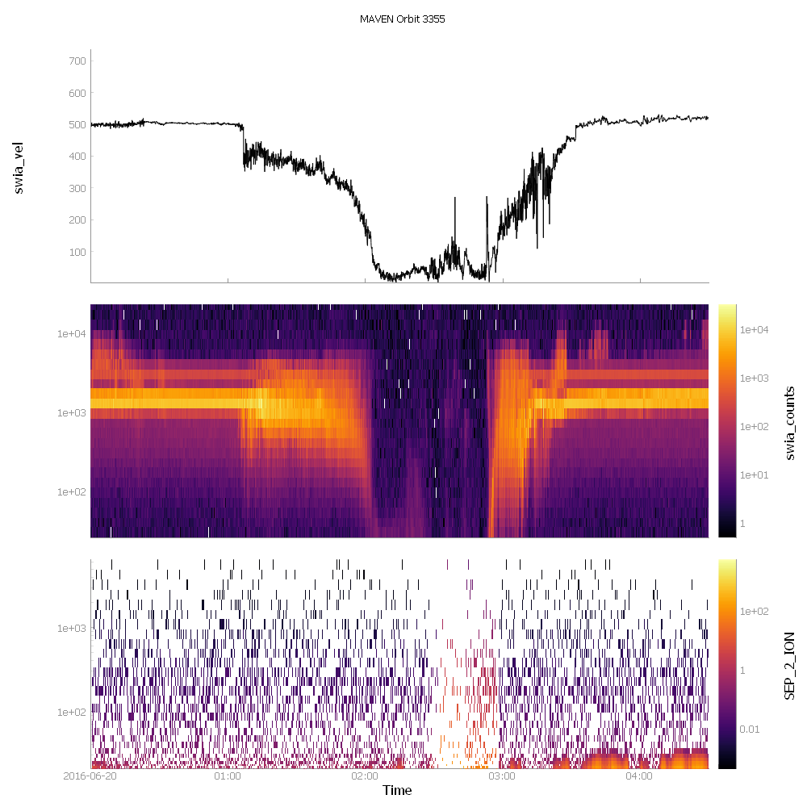

Introduction
===================

What is pytplot?
------------------

Pytplot is an effort by the Laboratory for Atmospheric and Space Physics to replicate the functionality IDL tplot library.  
It is a tool for manipulating, analyzing, and plotting time series data.  Primarily, it is focused on handling lines 
and spectrograms from satellite data.

What does it do?
-------------------

Because the tplot library evolved over several decades with new features being added depending on what scientists needed, 
there is a variety of things it does:

* Reads in data from a variety of sources (including netCDF and CDF file readers)
* Stores data in a common format, alongside all of its metadata and plot options.
* Plots the data in a stacked time series plot with time as the common axis.
* Easily add new axes 
* Provides a list of simple commands to modify the plots (line styles, colors, etc), or overplot two different variables
* Provides time series data analysis/manipulation routines
* Provides tools to enable mouse interactions with other python routines

