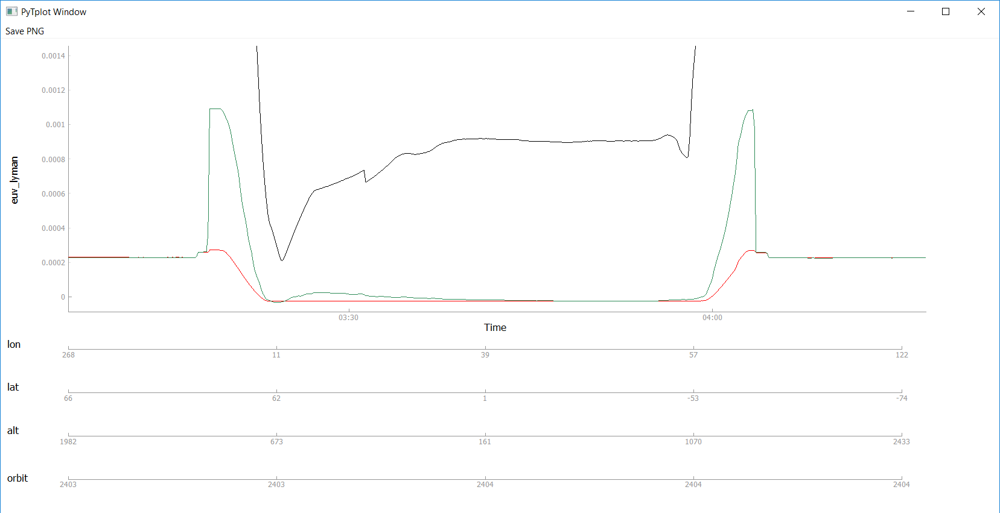

Plotting
=============

tplot function
--------------

All plotting is called through the "tplot()" function.  If you'd like to customize how you plots are displayed,
it is assume that you have set them up prior to calling this function.

.. autofunction:: pytplot.tplot

Oveplotting
-----------

To combine two or more variables in the same plot, you need to create a new variable like so::

	pytplot.store_data("new_variable", data=["variable1_to_overplot", "variable2_to_overplot"])
	
Then when you plot this new variable, it will be a combination of the two variables given in "data".  

.. note::
	Each variable should still retain the plot options you set for it, but I am still working out the kinks.  
	
	
Extra X axes
-------------

A commonly used feature of tplot is adding extra x axes (in addition to time), on the bottom of the plot.  

To do so in pytplot, specify which tplot variable(s) you'd like to to be included on the axis by passing them to the "var_label" option in tplot::

	pytplot.tplot("variable1", var_label = ["variable2", "variable3"])

.. note::
	Unfortunately, in the Bokeh plots currently the extra x axes must be linearly increasing in order to display properly.  Hopefully we can determine a way to map variables onto the axes at some point in the future.  

A common use case would be orbit numbers or spacecraft position.  Here is an example of multiple x axes below:

	

	